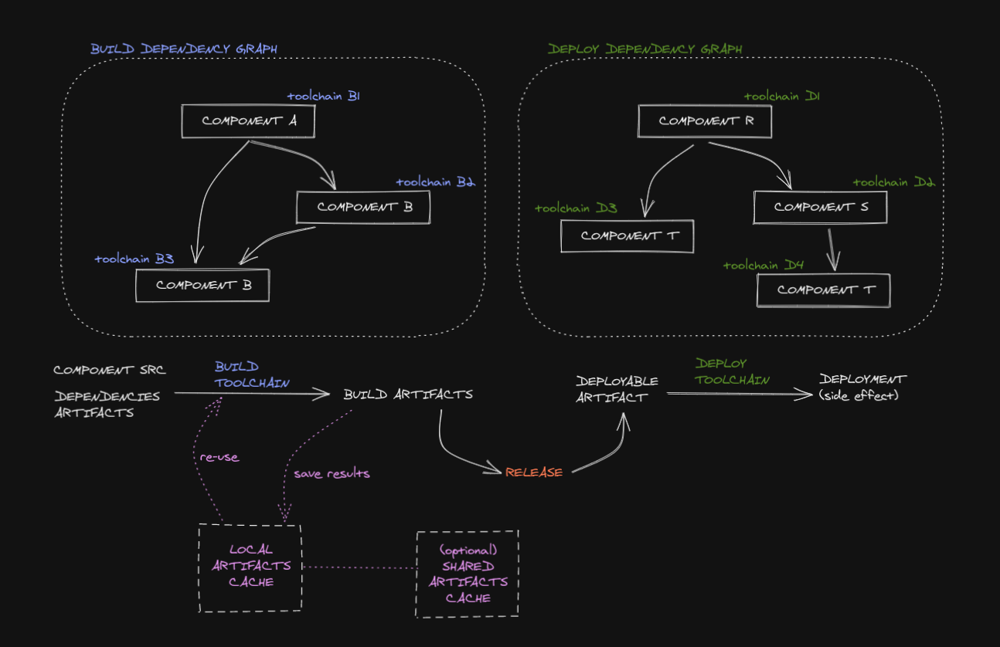

# MBS - a Meta Build System

## Introduction

A **Meta Build System** to organizate / build / release / deploy a large ~~micro~~ service oriented mono-repository with focus on **consistency**, **reproducibility** and **extensibility**.

Docker **containerization** technology is used both to run `mbs` and to define your own standardized toolchains to build and deploy your software components.

With MBS you can easly define the toolchains to build / deploy the different type of software components in you mono-repo and express the **dependency graph** among them (DAG), to consistently build only what's really changed (**checksum** based) and **cache** the results, a radically different approach to "git trigger based" pipeline services.

This will give you **parallelized** fast builds for free that can consistenly run on your dev machine (exactly like your CI runner) without any need for specific software installed but only docker and your mono-repo.

The user experience we aim to is a (meta) build system that let you properly work in a mono-repo that you feel like a modular monolith, but is built and deployed like a service oriented solution.

**TODO** explain that:
the system scales well, but: vertical build scalability, the git repo should fit in the dev machine

### Motivation

Soon or later most medium sized organization reach the point where they have to **standardize and normalize the CI / CD workflow** across products, teams etc.

Someone goes to the "million multi-repository jungle" and internal artifact hell versioning / compatibility matrix, while others opt to a single mono-repo or few of them. It's a matter of trade offs, considering the projects organization, teams, products, silos, people locations / offices, etc.
In general, no matter if you go for a single mono-repo or few projects oriented mono-repos, you need the glue (a standardized one) to keep things sorted and manageable, to make the dev (and ops) life easier / deterministic.

### Terminology
- **Toolchain**: defines your "build" / "deploy" recipes, standardized and parameterizable.
- **Component**: a sofware component, a piece of software with well defined functionalities and boundaries that can be build to a target artifact (via a toolchain). A component could be also a deployable target or not (for example a library that is only consumed by other components)

In other words we can think about *toolchains* as "functions" that turns *components* into *artifacts*. If you think about it, also *toolchains* are components, in fact there's a special "bootstrapping" *toolchain*, docker, that is able to turn a *toolchain component* into a toolchain (artifact).
MBS in a "high order function" that you feed with your mono-repo (a set of components and toolchain components) and gives you back the artifacts of your components built with your toolchain built with docker...

Later on, we will see how `mbs` "builds" `mbs`, as an example of these concepts.

### Use case

As explained above, `mbs` is mostly targeted at mono-repository, and if you landed here I think you know what I'm talking about (more info at [awesome-monorepo](https://github.com/korfuri/awesome-monorepo)).

It naturally feets well with domain / component oriented design.

Remember that, like every tool, `mbs` / mono-repos / etc. are just patterns and guidelines, not a silver bullet, and should not be misused otherwise you will shoot that silver bullet in your feet. So is essential to correclty design modules / components, their boundaries / what (business) logic we put into them and the dependecies we introduce beetween them.

### A bit of history

TODO:
extra reference to monorepo or other similar tools/solutions: cmake / ninja / doit / baur / please / hearthly / waypoint / gitlab / "pipelines in general".

TODO: describe the language oriented approach used by some tools (NPM workspaces, Elixir umbrella, GO, Rust cargo workspaces, ...), there the driver (obviously) is the language in mbs is the domain where you can develop together different things.

## The [build] -> [release] -> [deploy] -> [destroy!] flow



## Getting Started

To start playing with some toy examples, let's build first `mbs` (run `./ci.sh`, the only requirement is docker) and then `source mbs.sh` or `source mbs.fish` and play with `mbs`!

```sh
./ci.sh
source mbs.sh
```

For example run `mbs --help` and `mbs build ls`, it will list also some examples included in the repository under `examples/monorepo/`.

TODO: a quick tour based on the example/

TODO: A word about building `mbs` in `mbs`

## CLI interface

The information below are available via `mbs --help` or `mbs <COMMAND> <SUBCOMMAND> --help`.

### Commands

- **version**:           Show the mbs version
- **build graph**:       Generate dependency graph
- **build ls**:          List available targets
- **build outdated**:    Show outdated targets
- **build run**:         Run a target build
- **build shell**:       Interactive toolchain shell
- **build tree**:        Display a dependency tree
- **release ls**:        List available releases
- **release make**:      Make a deployable release
- **release rm**:        Delete a release
- **deploy destroy**     Destroy a release deploy
- **deploy graph**:      Generate dependency graph
- **deploy ls**:         List available targets
- **deploy run**:        Run a release deploy
- **deploy tree**:       Display a dependency tree

## Configuration

### MBS cache and release persistency

MBS caches **build artificats** and **releases artifacts** in two specific directory (inside the mbs container).

- Cache: `/.mbs-cache`
- Releases: `/.mbs-releases`
- Graph: `/.mbs-graph`

These directories should be mounted when running mbs otherwise you will loose the generated artificats between executions (no caching!).

The best approach is to "mount" these directories, for example to a host directory (bind mount) or to a docker volume (volume mount).
More info in [MBS wrapper script](###MBS-wrapper-script).

This approach is flexible enough to "share" the cache data between all the developers and the CI. It's enough to map the host dir to a "shared disk" (for example with S3FS-FUSE to share via aws S3, NFS, cifs, ...).

In a basic and safe setup, the cache should be shared in "read-only" mode to the developers and "read-write" to the CI.
Following this approach the developers will see and re-use the artifacts build by the CI while keeping the simplicity / conflict-less approach of a single cache writer.

### Environment variables

Environment variable that you can pass to `mbs`:

- `LOG_LEVEL`: set log level. For example `LOG_LEVEL="debug"` to turn on debug logs.
- `LOG_COLOR`: enable / disable color. For example `LOG_LEVEL="true"`, `LOG_LEVEL="false"`.

### Project

The project file should be placed in the repository root folder.
It lists all the components and toolchains folders. 

The approach of mbs is to have an explicit component's inclusion and it doesn't support auto-discovery. Auto-discovery (via wildcard globs search) works well in small repository, but it's heavy on the filesystem when you work on repositories with lots of (git untracked) files.

Even more, being explicit, you can put in or out a component just adding or removing the component directory from the project file.

`.mbs-project.json`

```js
{
    "dirs": [
        "components/a",
        "components/b",
        "components/c",
        "toolchains/x",
        "toolchains/y",
    ]
}
```

### Global configuration

MBS execution global configuration parameters.

`.mbs-config.json`

```js
{
    // [optional] parallelism: run parallelism
    // [default] n. available cores
    "parallelism": 16,
    // [optional] timeout: components run global timeout sec
    // [default] infinity
    "timeout": 3600,
    // [optional] files_profile: a set of predefined files profile
    "files_profile": {
        "elixir": [
            ".formatter.exs",
            "mix.{exs,lock}",
            "config/*.exs",
            "{apps,lib,test}/**/*.{ex,exs}"
        ],
        "c": [
            "**/*.{c,h}",
            "CMakeLists.txt",
        ]
    }
}
```

### Toolchain manifest (`.mbs-toolchain.json`)

```js
{
    // id: toolchain identifier
    "id": "toolchain-abc",
    // [optional] timeout: toolchain build timeout sec
    // [default] the global one | infinity
    "timeout": 3600,
    "toolchain": {
        // dockerfile: toolchain dockerfile
        "dockerfile": "Dockerfile",
        // [at least one of] files | files_profile
        // files: build "input" files (glob expression allowed)
        // these are the files "watched" for changes,
        // define this list very carefully
        // files_profile: the config file profile to use
        "files": [
            "build.sh"
        ],
        "files_profile": "...",
        // [optional] deps_change_step: step executed if and only if
        // a dependency (transitively) change
        "deps_change_step": "deps_change",
        // steps: toolchains steps
        // the toolchain will be executed calling the toolchain docker
        // image with the following steps as command, sequentially
        "steps": [
            "deps",
            "compile",
            "lint",
            "test",
            "build"
        ]
        // [optional] destroy_steps: toolchain destroy steps
        // this is tipically used when defining a "deploy" toolchain
        "destroy_steps": [
            "destroy"
        ]
    }
}
```

### Component build manifest (`.mbs-build.json`)

```js
{
    // id: component identifier
    "id": "component-xyz",
    // [optional] timeout: components build timeout sec
    // [default] the global one | infinity
    "timeout": 3600,
    "component": {
        // toolchain: toolchain used to build the component
        "toolchain": "toolchain-abc",
        // [optional] toolchain_opts: toolchain run options
        // passed to every toolchain "step" commands
        // MBS_* environment variable expansion supported
        "toolchain_opts": ["--type", "app"],
        // [at least one of] files | files_profile
        // files: build "input" files (glob expression allowed)
        // these are the files "watched" for changes,
        // define this list very carefully
        // files_profile: the config file profile to use
        "files": [
            "**/*.c",
            // glob negation via "!"
            "!example/**/*"
        ],
        "files_profile": "...",
        // targets: build output targets
        // supported target are files (via file:// scheme or no scheme)
        // and docker images (docker://)
        "targets": [
            "xyz-target.bin"
        ],
        // [optional] dependencies: build "dependencies"
        // components this build depends on.
        // This is the element that define the build graph.
        // These dependencies will run before the current
        // component and their target will be available to this component
        "dependencies": [
            "xyz-library"
        ],
        // [optional] docker_opts: specific "docker run" options to add
        // when running the toolchain
        "docker_opts": ["--net", "host"]
    }
}
```

### Component deploy manifest (`.mbs-deploy.json`)

```js
{
    // id: component identifier
    "id": "component-xyz",
    // [optional] timeout: components deploy timeout sec
    // [default] the global one | infinity
    "timeout": 3600,
    "component": {
        // toolchain: toolchain used to deploy the component's target
        "toolchain": "toolchain-abc",
        // [optional] toolchain_opts: toolchain run options
        // passed to every toolchain "step" commands
        // MBS_* environment variable expansion supported
        "toolchain_opts": ["--type", "app"],
        // files: toolchain deployed artifacts
        // this should be a subset of targets in the same
        // component .mbs-build.json manifest
        "files": [
            "xyz-target.bin"
        ],
        // [optional] dependencies: deploy "dependencies"
        //  components this deploy depends on.
        //  This is the element that define the build graph.
        //  These dependencies will run before the current
        //  component and their target will be available
        //  to this component
        "dependencies": [
            "xyz-infrastructure"
        ]
    },
    // [optional] specific "docker build" options to add when running a toolchain build
    "docker_opts": []
}
```

## Files and files_profile rules

The global config key "files_profile" defines a **set of predefined files profile**
that can be referenced in the single components to avoid duplication.

In the component's manifest it's possible to specify both a file_profile and a files list. In this case files rules will override the one in file_profiles.

For example, give the following component's manifest:

```js
{
    "id": "an_elixir_component"
    "files_profile": "elixir",
    "files": [
        "!**/*.tmp.ex"
    ]
}
```

mbs will track and watch files collected from the elixir profile rules but nothing that could match
files like "*.tmp.ex".

## Toolchains development

Every mbs toolchains is defined by a docker image (ref manifest field: `dockefile`) and package all the specific tooling for a particular job. A toolchain encode the recipe for building targets out of components in discrete steps (ref manifest field: `steps`).

### Interface

The toolchain interface is very simple and CLI oriented.

Let's say we have a component:

```js
{
    "id": "make_coffee",
    "component": {
        "toolchain": "toolchain-build-cmake",
        "toolchain_opts": ["--param1", "a", "--switch2"],
        "files": [
            "CMakeLists.txt",
            "main.c"
        ],
        "targets": [
            "build/make_coffee"
        ]
    }
}
```

that is build with the cmake toolchain:

```js
{
    "id": "toolchain-build-cmake",
    "toolchain": {
        "dockerfile": "Dockerfile",
        "files": [
            "build.sh"
        ],
        "steps": [
            "build",
            "lint",
            "test",
            ...
        ]
    }
}
```

When we `mbs build run make_coffee`, `mbs` will apply the toolchain recipe to build the component (after building any upstream dependency, toolchain included, if needed).

By abstraction, if we think the toolchain as an "executable binary", the build process will be:

```sh
cd monorepo/components/make_coffee
toolchain-build-cmake "build" --param1 a --switch 2
toolchain-build-cmake "lint" --param1 a --switch 2
toolchain-build-cmake "test" --param1 a --switch 2
...

```

And at the end it expect to find the component target `build/make_coffee`.

### Environment variables

A set of predefined environment variables are available in the toolchain run context:

- `MBS_ID`: the component identifier (ref .mbs-*.json `id` field)
- `MBS_CWD`: component current working directory
- `MBS_CHECKSUM`: component checksum
- `MBS_CHECKSUM_<deps_name_normalized>`: one for every deps, the dependency checksum. For example, give a dependency named `my-lib` we will have `MBS_CHECKSUM_MY_LIB`.

Note: these variables can be referenced in the "toolchain_opts" list.

### Dependencies directory

Dependencies target are made available to the toolchain in the components base directory under `.deps/`. The toolchain will see all the targets from the **transive dependency closure** of the component.

For example if a component A depends on a component B (that targets `b1.bin` and `b2.bin`) that depends on a component C (that targets `c1.bin`), then component A toolchains will see under `.deps/A/{b1.bin,b2.bin,c1.bin}`.

### Dependencies change

Given a component C dependent on another component D, if we detect a change in D then C is also re-built. In C's toolchain, as the first steps we normally install the component dependencies (public and internal dependencies).

Internal dependencies are normally copied / installed so that they are visible in the component's build context and can be consumed in the build process.

Now, if we execute this step unconditionally every time we run a component's build, we would install all the internal dependencies and maybe re-trigger their build wasting time. This re-build normally happens when we (or the language) share packages in source form and not compiled form, or when the language builder looks at timestamps (not checksums) to re-build its targets.

This problem is addressed with the "deps_change_step" in the toolchain manifest, it will be executed as the very first step if and only if a dependency change. For example if you change a component source file and no dependency is changed, only the toolchain steps will be executed.

## MBS Development

Development should aim to correctness, simplicity, sensible defaults and "small" codebase (with very few dependencies).

### Bootstrap / Build

Requirements: `docker`

The `ci.sh` script builds two docker images (`mbs:slim`, `mbs:full`).
These images can be used to run `mbs` on any system with docker support.

A convenient alias can be defined to use `mbs` as a native CLI application. Pay attention to the `$PWD` in the alias, it will use the cwd from within you issue the `mbs` aliased command. So it won't work if don't issue it from the repo root directory.

```bash
alias mbs="\
    docker run --init --rm -ti \
        -v /var/run/docker.sock:/var/run/docker.sock \
        -v $PWD:$PWD -w $PWD \
        ... \
        mbs:full
"
```

### MBS wrapper script

It's definetely better to use a wrapper script like [mbs.sh](./mbs.sh) in this repository, the script should be include and committed in your repository. The script can also be "sourced": `source mbs.sh`.
