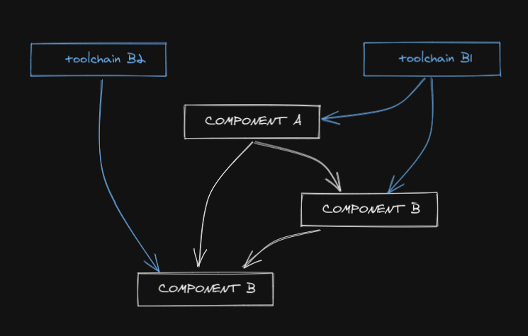

# MBS - a Meta Build System

A fully dockerized **Meta Build System** to build, release and deploy a large service oriented mono-repository with focus on **consistency**, **reproducibility** and **extensibility**.

**Containerization** is used both to run `mbs` and to define your own standardized toolchains to build and deploy your software components.

With MBS you can easly define the toolchains to build and deploy the different type of software components in you mono-repo and express the **dependency graph** among them (DAG), to consistently build only what's really changed (**checksum** based) and **cache** the results, a radically different approach to "git trigger based" pipeline services. Also the toolchains (used to build your components) should be part of the repository: change a toolchain -> rebuild everything that depends on the toolchain.

This will give you **parallelized** fast builds for free that can consistenly run on your dev machine (exactly like your CI runner) without any need for specific software installed, but only docker and your mono-repo.

The user experience we aim to is a (meta) build system that let you properly work in a mono-repo that you feel like a modular monolith, but is built and deployed like a service oriented solution.

To summarize:
- build / release / deploy support
- first class DAG dependencies (parallelized execution)
- checksum based diff detection
- sandboxed build
- no development environment on your machine, just docker

## Documentation
  * [Introduction](docs/introduction.md)
  * [Architecture and workflow](docs/architecture-and-workflow.md)
  * [Hermetic execution and sandboxing](docs/hermetic-execution-and-sandboxing.md)
  * [Getting Started](docs/getting-started.md)
  * [CLI interface](docs/cli-interface.md)
  * [Configuration](docs/configuration.md)
  * [Toolchains development](docs/toolchains-development.md)
  * [Components development](docs/components-development.md)