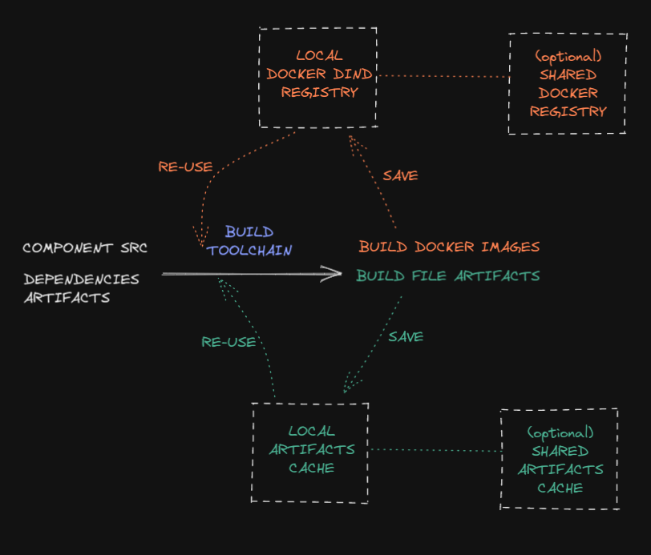

## Configuration

### MBS cache and release persistency

MBS caches **build artifacts** and **releases artifacts** in two specific directory (inside the mbs container).

- Artifacts local cache: `/.mbs-local-cache`
- Releases: `/.mbs-releases`
- Graph: `/.mbs-graph`

Docker images are stored in your local host docker registry.



MBS will leverage the local caches to rebuild only what's changed.

Optionally it's possible to define "remote caches" to have a cache shareable beetween the developers and the CI.

In `.mbs-config.json` you can configure them, ref. [Global configuration](#global-configuration). The relevant part is:

```js
{
    "cache": {
        "push": false,
        "volume": "/nfs_share/mbs-myproject-cache",
        "docker_registry": "https://my-private-docker-registry:5000"
    }
}
```

- cache.push: enable/disable push to the remote caches
- cache.volume: the host directory where we mount the remote cache folder
- cache.docker_registry: the external docker registry

This approach is flexible enough to "share" the cache data between all the developers and the CI. It's enough to map the host dir to a "shared disk" (for example with NFS, cifs, ...).

In a basic and safe setup, the cache should be shared in "read-only" mode to the developers (`"push": false`) and "read-write" to the CI (`"push": true`).
Following this approach the developers will see and re-use the artifacts build by the CI while keeping the simplicity / conflict-less approach of a single cache writer.

### Project

The project file should be placed in the repository root folder.
It lists all the components and toolchains folders.

The approach of mbs is to have an explicit component's inclusion and it doesn't support auto-discovery. Auto-discovery (via wildcard globs search) works well in small repository, but it's heavy on the filesystem when you work on repositories with lots of (git untracked) files.

Even more, being explicit, you can put in or out a component just adding or removing the component directory from the project file.

`.mbs-project.json`

```js
{
    "dirs": [
        "components/a",
        "components/b",
        "components/c",
        "toolchains/x",
        "toolchains/y",
    ]
}
```

### Global configuration

MBS execution global configuration parameters.

`.mbs-config.json`

```js
{
    // the project identifier
    "project": "mbs",
    // log level and color
    "log": {
        "level": "info",
        "color": true
    },
    // cache config
    "cache": {
        // remote volume and docker_registry, push enables/disable remote push
        // leave volume / docker_registry empty to don't use a remote cache at all
        "push": false,
        "volume": "",
        "docker_registry": ""
    },
    // [optional] parallelism: run parallelism
    // [default] n. available cores
    "parallelism": 16,
    // [optional] timeout: components run global timeout sec
    // [default] infinity
    "timeout": 3600,
    // [optional] files_profile: a set of predefined files profile
    "files_profile": {
        "elixir": [
            ".formatter.exs",
            "mix.{exs,lock}",
            "config/*.exs",
            "{apps,lib,test}/**/*.{ex,exs}"
        ],
        "c": [
            "**/*.{c,h}",
            "CMakeLists.txt",
        ]
    }
}
```

### Toolchain manifest

```js
{
    // id: toolchain identifier
    "id": "toolchain-abc",
    // [optional] timeout: toolchain build timeout sec
    // [default] the global one | infinity
    "timeout": 3600,
    "toolchain": {
        // dockerfile: toolchain dockerfile
        "dockerfile": "Dockerfile",
        // [at least one of] files | files_profile
        // files: build "input" files (glob expression allowed)
        // these are the files "watched" for changes,
        // define this list very carefully
        // files_profile: the config file profile to use
        "files": [
            "build.sh"
        ],
        "files_profile": "...",
        // [optional] deps_change_step: step executed if and only if
        // a dependency (transitively) change
        "deps_change_step": "deps_change",
        // steps: toolchains steps
        // the toolchain will be executed calling the toolchain docker
        // image with the following steps as command, sequentially
        "steps": [
            "deps",
            "compile",
            "lint",
            "test",
            "build"
        ]
        // [optional] destroy_steps: toolchain destroy steps
        // this is tipically used when defining a "deploy" toolchain
        "destroy_steps": [
            "destroy"
        ]
    }
}
```

### Component build manifest

```js
{
    // id: component identifier
    "id": "component-xyz",
    // [optional] timeout: components build timeout sec
    // [default] the global one | infinity
    "timeout": 3600,
    "component": {
        // toolchain: toolchain used to build the component
        "toolchain": "toolchain-abc",
        // [optional] toolchain_opts: toolchain run options
        // passed to every toolchain "step" commands
        // MBS_* environment variable expansion supported
        "toolchain_opts": ["--type", "app"],
        // [at least one of] files | files_profile
        // files: build "input" files (glob expression allowed)
        // these are the files "watched" for changes,
        // define this list very carefully
        // files_profile: the config file profile to use
        "files": [
            "**/*.c",
            // glob negation via "!"
            "!example/**/*"
        ],
        "files_profile": "...",
        // targets: build output targets
        // supported target are files (via file:// scheme or no scheme)
        // and docker images (docker://)
        "targets": [
            "xyz-target.bin"
        ],
        // [optional] dependencies: build "dependencies"
        // components this build depends on.
        // This is the element that define the build graph.
        // These dependencies will run before the current
        // component and their target will be available to this component
        "dependencies": [
            "xyz-library"
        ],
        // [optional] services: sidecar services via docker-compose
        "services": [
            "dockerfiles/docker-compose.yml"
        ]
    },
    // [optional] docker_opts: specific "docker run" options to add
    // when running the toolchain
    "docker_opts": ["--net", "host"]
}
```

### Component deploy manifest

```js
{
    // id: component identifier
    "id": "component-xyz",
    // [optional] timeout: components deploy timeout sec
    // [default] the global one | infinity
    "timeout": 3600,
    "component": {
        // toolchain: toolchain used to deploy the component's target
        "toolchain": "toolchain-abc",
        // [optional] toolchain_opts: toolchain run options
        // passed to every toolchain "step" commands
        // MBS_* environment variable expansion supported
        "toolchain_opts": ["--type", "app"],
        // files: toolchain deployed artifacts
        // this should be a subset of targets in the same
        // component .mbs-build.json manifest
        "files": [
            "xyz-target.bin"
        ],
        // [optional] dependencies: deploy "dependencies"
        //  components this deploy depends on.
        //  This is the element that define the build graph.
        //  These dependencies will run before the current
        //  component and their target will be available
        //  to this component
        "dependencies": [
            "xyz-infrastructure"
        ]
    },
    // [optional] specific "docker build" options to add when running a toolchain build
    "docker_opts": []
}
```

### Files and profile rules

The global config key "files_profile" defines a **set of predefined files profile**
that can be referenced in the single components to avoid duplication.

In the component's manifest it's possible to specify both a file_profile and a files list. In this case files rules will override the one in file_profiles.

For example, give the following component's manifest:

```js
{
    "id": "an_elixir_component"
    "files_profile": "elixir",
    "files": [
        "!**/*.tmp.ex"
    ]
}
```

mbs will track and watch files collected from the elixir profile rules but nothing that could match
files like "*.tmp.ex".

### Sidecar services

It's possible execute a compoment build having the toolchain "linked" to a docker-compose (ref: build manifest "services" field).
This can be used to run integration tests together with some external services (DB, cache, queue, etc.)
