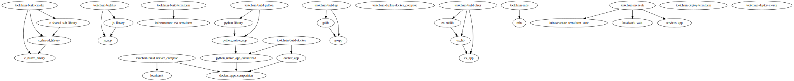

## Getting Started


### Install

As describe in the introduction, `mbs` is distributed as a docker image, so you don't need to install any executable.

The only prerequisite is docker.

### Init a new repo

To initialize a new repository:

```sh
cd my_project

# NOTE: here the MBS version you will use
MBS_VERSION=x.y.z

# NOTE: substitute project_name with yours
docker run --rm -ti -v $PWD:/repo -w /repo visciang/mbs:$MBS_VERSION init project_name
```

The `docker run` command will pull the mbs image and run it with the `init` command in the repository directory.
It will setup the repository directory with a couple of config file (`.mbs-config.json`, `.mbs-project.json`) and `mbs.sh` script.

More details about the config files in [Configuration](configuration.md).
`mbs.sh` script is a convenient wrapper around the `docker run` command (you can also source it and you will have an `mbs` alias in the shell).

After the init command we have:

```sh
ls -a
.mbs-config.json  .mbs-project.json  mbs.sh*
```

Now we should be able to run mbs:

```sh
./mbs.sh --help

# or

source `./mbs.sh`
mbs --help
```

### Let's play

The github repository `visciang/mbs-example-monorepo` includes some examples, so it's convenient to play there to get the feeling of how you can use `mbs` in different contexts.

This will be the same onboarding experience you will have joining the development of an `mbs` managed monorepo.

The below example won't install anything on your machine, but it will download and create docker images and two docker volumes for the artifacts cache and releases.

```sh
cd /tmp
git clone --depth 1 https://github.com/visciang/mbs-example-monorepo
```

```sh
cd /tmp/mbs-example-monorepo
source ./mbs.sh
mbs --help
```

Let's list the available components:

```sh
mbs build ls

# OUTPUT
c_native_binary  (component)
c_shared_library  (component)
c_shared_sub_library  (component)
docker_app  (component)
docker_apps_composition  (component)
ex_app  (component)
ex_lib  (component)
ex_sublib  (component)
goapp  (component)
golib  (component)
infrastructure_terraform_state  (component)
infrastructure_via_terraform  (component)
js_app  (component)
js_library  (component)
localstack  (component)
localstack_wait  (component)
python_library  (component)
python_native_app  (component)
python_native_app_dockerized  (component)
services_app  (component)
toolchain-build-cmake  (toolchain)
toolchain-build-docker  (toolchain)
toolchain-build-docker_compose  (toolchain)
toolchain-build-elixir  (toolchain)
toolchain-build-go  (toolchain)
toolchain-build-js  (toolchain)
toolchain-build-python  (toolchain)
toolchain-build-terraform  (toolchain)
toolchain-deploy-awscli  (toolchain)
toolchain-deploy-docker_compose  (toolchain)
toolchain-deploy-terraform  (toolchain)
toolchain-meta-sh  (toolchain)

Completed (0 jobs) (0.053 sec)
```

To have a better picture of the components dependencies:

```sh
mbs build graph
# this will produce .mbs-graph/graph.svg
```

`.mbs-graph/graph.svg` plots the dependency graph:



Now, we can build only a subset of the components, for instance `c_native_binary`.
If we check the deps graph you will see it depends on `c_shared_library` that depends on `c_shared_sub_library`, and they all depends on the `toolchain-build-cmake`.

Alternativelly, we can see the dependency tree also in the CLI:

```sh
mbs build tree c_native_binary

# OUTPUT
└── c_native_binary
    ├── c_shared_library
    │   ├── c_shared_sub_library
    │   │   └── toolchain-build-cmake
    │   └── toolchain-build-cmake
    └── toolchain-build-cmake

Completed (0 jobs) (0.056 sec)
```

Before we run the build, let's get more info about `c_native_binary` component:

```sh
mbs build ls --verbose c_native_binary

# OUTPUT
c_native_binary  (component):
  dir:
    /tmp/mbs-example-monorepo/examples/monorepo/components/c_examples/c_native_binary
  timeout:
    infinity
  toolchain:
    toolchain-build-cmake
  targets:
    - /tmp/mbs-example-monorepo/examples/monorepo/components/c_examples/c_native_binary/.build/c_native_binary
  files:
    - /tmp/mbs-example-monorepo/examples/monorepo/components/c_examples/c_native_binary/.mbs-build.json
    - /tmp/mbs-example-monorepo/examples/monorepo/components/c_examples/c_native_binary/CMakeLists.txt
    - /tmp/mbs-example-monorepo/examples/monorepo/components/c_examples/c_native_binary/main.c
  dependencies:
    - c_shared_library
```

Run the build:

```sh
mbs build run --verbose c_native_binary

# OUTPUT
. - toolchain-build-cmake:build   ~ Sending build context to Docker daemon  4.096kB
. - toolchain-build-cmake:build   ~ 

  ...

. - c_native_binary:build   ~ 
. - c_native_binary:build   ~ [ 50%] Building C object CMakeFiles/c_native_binary.dir/main.c.o
. - c_native_binary:build   ~ 
. - c_native_binary:build   ~ [100%] Linking C executable c_native_binary
. - c_native_binary:build   ~ 
. - c_native_binary:build   ~ [100%] Built target c_native_binary
. - c_native_binary:build   ~ 
✔ - c_native_binary:build   (1.064 sec) 
✔ - c_native_binary   (1.076 sec) ~ AF4HPEN5Y4LSTDNGG42YIJDEOTOZLF2ABYRE7SUJIF5QFLXLSZYA

Completed (7 jobs) (46.843 sec)
```

When the build is complete, let's run it again (it will be a fully cached run):

```sh
mbs build run --verbose c_native_binary

# OUTPUT
✔ - toolchain-build-cmake   (0.03 sec) ~ GEYSPDOBUCRI227AEHO5J5MRO4CKVD4UWY5CGOWLZG6SDYLOMRDQ
✔ - c_shared_sub_library   (0.001 sec) ~ PGWFSGRKY3CFISKFAMGTCTXIZXGAOVWHDZ54RZY5UAU34HE44Z4A
✔ - c_shared_library   (0.0 sec) ~ PWNH7OP52HZBWCTOS4T6DI2I6YEORH46GJFF24TOG5GGDQWX4R7Q
✔ - c_native_binary   (0.0 sec) ~ AF4HPEN5Y4LSTDNGG42YIJDEOTOZLF2ABYRE7SUJIF5QFLXLSZYA

Completed (4 jobs) (0.091 sec)
```

If we look at the `c_native_binary` components directory we will see the intermediate build files.

The same build can be run in sandbox mode:

```sh
mbs build run --verbose --sandbox c_native_binary
```

and in this case the directory will remain clean.

Now let's change some code, for instance we can edit `examples/monorepo/components/c_examples/c_shared_library/lib.c` (introduce a change to the "Hello!\n" string).
If we run again the build it will rebuild only `c_shared_library` -> `c_native_binary`

```sh
mbs build run --verbose c_native_binary

# OUTPUT
mbs build run --verbose c_native_binary
✔ - toolchain-build-cmake   (0.03 sec) ~ GEYSPDOBUCRI227AEHO5J5MRO4CKVD4UWY5CGOWLZG6SDYLOMRDQ
✔ - c_shared_sub_library   (0.001 sec) ~ PGWFSGRKY3CFISKFAMGTCTXIZXGAOVWHDZ54RZY5UAU34HE44Z4A
. - c_shared_library:build   ~ -- The C compiler identification is GNU 10.2.0
. - c_shared_library:build   ~

 ...

 . - c_native_binary:build   ~ [100%] Linking C executable c_native_binary
. - c_native_binary:build   ~ 
. - c_native_binary:build   ~ [100%] Built target c_native_binary
. - c_native_binary:build   ~ 
✔ - c_native_binary:build   (0.956 sec) 
✔ - c_native_binary   (0.964 sec) ~ KGKJ6WES7BRUW5UFTSE2GG2QZONVGDB6PKTCEEEQ7XAT63XQBM4A
```

If we revert the change just made in `examples/monorepo/components/c_examples/c_shared_library/lib.c` and run again the build, we will see it's fully cached.

Let's go on building all the components (it will take a while):

```sh
mbs build run --verbose
```

We will see the build of indipendent components running in parallel.
When it's ready, let's use another command to check that nothing is outdated.

```sh
mbs build outdated

# OUTPUT
Completed (0 jobs) (0.233 sec)
```

TODO release -> deploy tour
